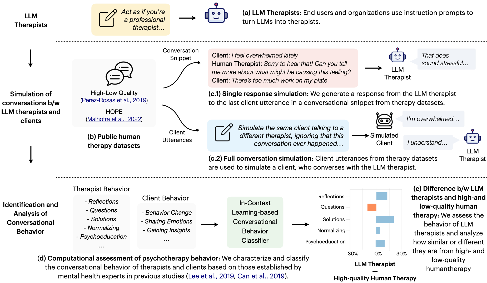

# BOLT

This repository contains the code for our [paper](https://arxiv.org/abs/2401.00820) on behavioral assessment of LLM therapists.


If this code helps you in your research, please cite the following publication:
```bash
@inproceedings{chiu2024bolt,
    title={A Computational Framework for Behavioral Assessment of LLM Therapists},
    author={Chiu, Yu Ying and Sharma, Ashish and Lin, Inna Wanyin and Althoff, Tim},
    journal={arXiv preprint arXiv:2401.00820},
    year={2024}
}
```


## Introduction
The emergence of ChatGPT and other large language models (LLMs) has greatly increased interest in utilizing LLMs as therapists to support individuals struggling with mental health challenges. However, due to the lack of systematic studies, our understanding of how LLM therapists behave, i.e., ways in which they respond to clients, is significantly limited. Understanding their behavior across a wide range of clients and situations is crucial to accurately assess their capabilities and limitations in the high-risk setting of mental health, where undesirable behaviors can lead to severe consequences. In this paper, we propose BOLT, a novel computational framework to study the conversational behavior of LLMs when employed as therapists.  We develop an in-context learning method to quantitatively measure the behavior of LLMs based on 13 different psychotherapy techniques including reflections, questions, solutions, normalizing, and psychoeducation. Subsequently, we compare the behavior of LLM therapists against that of high- and low-quality human therapy, and study how their behavior can be modulated to better reflect behaviors observed in high-quality therapy. Our analysis of GPT and Llama-variants reveals that these LLMs often resemble behaviors more commonly exhibited in low-quality therapy rather than high-quality therapy, such as offering a higher degree of problem-solving advice when clients share emotions, which is against typical recommendations. At the same time, unlike low-quality therapy, LLMs reflect significantly more upon clients' needs and strengths. Our analysis framework suggests that despite the ability of LLMs to generate anecdotal examples that appear similar to human therapists, LLM therapists are currently not fully consistent with high-quality care, and thus require additional research to ensure quality care.





## Quickstart

### 1. Prerequisites

Our code can be compiled on Python 3.9+ environments. First, clone the repository:
```
git clone https://github.com/behavioral-data/BOLT.git
cd BOLT
```

Next, create a new environment and install the required packages:
```
conda create -n bolt python=3.9
conda activate bolt
pip install -r requirements
```

This code uses OpenAI's python library. Please ensure that you set the `OPENAI_API_KEY` environment variable to your OpenAI API key. You can find your API key at [platform.openai.com/api-keys](https://platform.openai.com/api-keys).

### 2. HOPE_DATA_EXAMPLES

This folder consists of 8 transcripts from the HOPE dataset of real transcripts between patients and therapists which are used for the context of the GPT patient.

### 3. data

This folder consists of all the data that was generated with ash. In the conversations folder are each individual conversation with ash. Ash.csv is all of these conversations combined into 1 dataset. Ash_therapist_output.csv are all the characteristics of each therapist utterance

### 4. evaluations

This folder consists of all the frequency and temporal_order_frequency evaluations for Ash

### 5. prompts

This folder consists of all the behavioral characteristics for clients and therapists, with their definitions and examples. This is used to categorize each utterance.

### 5. DATASET_PATHS

This file takes the chatbot name and links it to an input and output dataset. For example, takes "ash" and links it to "ash.csv" and "ash_therapist_output.csv". This is useful as you accumumlate more chatbots. Then instead of having to find each input and output file name each time, you can just put the chatbot name in and run it.

### 6. Run SimulateClient.py

This file simulates the client from the HOPE_DATASET and creates the GPT patient that you want to interact with. To switch the patient that you want to replicate, switch this line to match the file of the conversation you want to replicate.

file = f"BOLT/HOPE_Data_Examples/patient{csv_index}.csv"

From there, just run this file and then you can simulate conversations as the code will prompt you to respond as therapist.

### 7. Run main.py

To run the full main.py workflow, add api key to "api_key" variable in therapist_behavior_inference.py: 
and then run

python main.py --[chatbot name]

such as 

python main.py --"ash"

If you do not add a chatbot name, it will default to Ash. If you add a new chatbot, make sure to update DATASET_PATHS.py with the relevant files.
